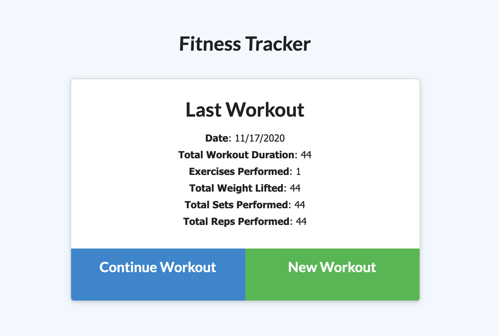
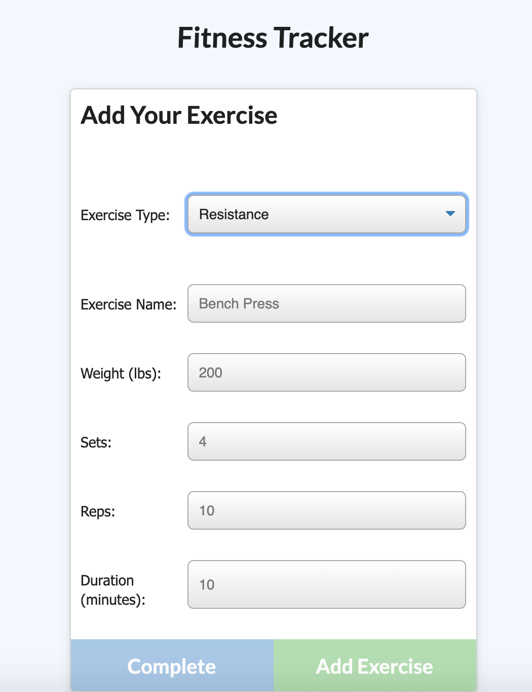

[![LinkedIn][linkedin-shield]][linkedin-url]
[![MIT License][license-shield]][license-url]
[![Portfolio][portfolio-shield]][portfolio-url]
<!-- See bottom of readme for badge information -->


<!-- MY LOGO FROM NOUN PROJECT-->
<br />
<p align="center">
  <a href="https://github.com/ClaireBohlen">
    
  </a>

  <h3 align="center">Fitness Tracker</h3>

  <p align="center">
    Quick Description
    <br />
    <!-- Enter repo url here -->
    <a href="https://github.com/ClaireBohlen/fitnessTracker"><strong>Explore the Repo »</strong></a> 
    <br />
    <br />
    <a href="https://fierce-spire-72446.herokuapp.com/">Live Demo 🚀</a>
    
   
  </p>
</p>


<!-- Table of Contents -->
<details open="open">
  <summary><h2 style="display: inline-block">Table of Contents</h2></summary>
  <ol>
    <li>
      <a href="#about-the-project">About The Project</a>
      <ul>
        <li><a href="#built-with">Built With</a></li>
      </ul>
    </li>
    <li>
      <a href="#getting-started">Getting Started</a>
      <ul>
        <li><a href="#prerequisites">Prerequisites</a></li>
        <li><a href="#installation">Installation</a></li>
      </ul>
    </li>
    <li><a href="#license">License</a></li>
    <li><a href="#contact">Contact</a></li>
    
  </ol>
</details>


<!-- ABOUT THE PROJECT -->
## About The Project

<!-- Take a screen shot and save it in readMeAssets -->




Fitness Tracker is an application that can track past and current workouts, display the current date & display to the totl duration of your workout history. You can add new workouts from two catergories and store them using Mongo Atlas.


### Built With
<!-- * [Laravel](https://laravel.com) -->
* JavaScript
* Node.js
* MongoDB
* Express
* Mongoose 


<!-- GETTING STARTED -->
## Getting Started

To get a local copy up and running follow these simple steps.

### Prerequisites

<!-- Node Package Manager -->
* npm
  ```sh
  npm install npm@latest -g
  ```

### Installation

1. Clone the repo
   ```sh
   git clone https://github.com/ClaireBohlen/fitnessTracker.git
   ```
2. Install NPM packages
   ```sh
   npm install
   ```


<!-- LICENSE -->
## License

Distributed under the MIT License. See `LICENSE` for more information.


<!-- CONTACT -->
## Contact

Claire C. Bohlen - clairebohlen@gmail.com


<!-- MARKDOWN LINKS & IMAGES -->
<!-- https://www.markdownguide.org/basic-syntax/#reference-style-links -->

[portfolio-shield]: https://img.shields.io/badge/PORTFOLIO-URL-blueviolet
[portfolio-url]: https://clairebohlen.github.io/React-Update-Portfolio-2.0/#/


[license-shield]: https://img.shields.io/badge/LICENSE-MIT-blueviolet
[license-url]: (readMeAssets/LICENSE.txt)

[linkedin-shield]: https://img.shields.io/badge/-LINKEDIN-blueviolet
[linkedin-url]: https://www.linkedin.com/in/claire-bohlen-63a4b5119/
